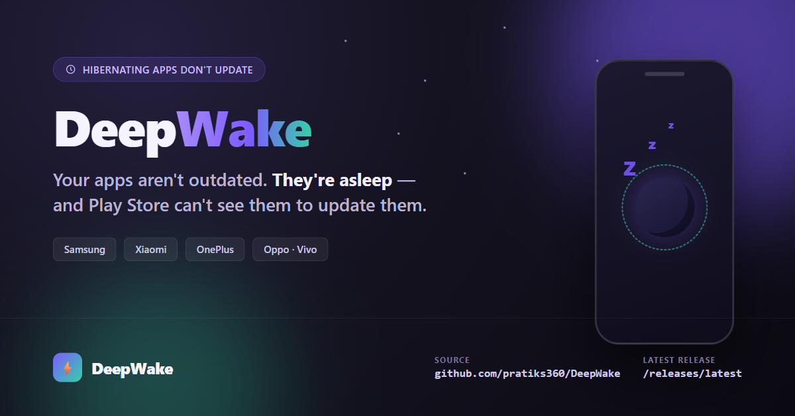

<p align="center">
  
</p>

<p align="center">
  <h1 align="center">🌙 DeepWake</h1>
  <p align="center">
    <strong>Wakes the apps your phone is hiding from Play Store, so they actually get updated.</strong>
  </p>
  <p align="center">
    <a href="https://github.com/pratiks360/DeepWake/releases/latest"></a>
    
    
    
  </p>
</p>

---

## 📋 Table of Contents

- [What Is This?](#-what-is-this)
- [Features](#-features)
- [Screenshots](#-screenshots)
- [Quick Start](#-quick-start)
- [How It Works](#-how-it-works)
- [Permissions](#-permissions)
- [Tech Stack](#️-tech-stack)
- [Troubleshooting](#-troubleshooting)
- [Contributing](#-contributing)
- [License](#-license)

---

## ✨ What Is This?

Android hibernates apps you don't open often to save battery — Samsung, Xiaomi, OnePlus, Oppo and Vivo all run their own flavor of this. The problem: **a hibernated app is invisible to Play Store's own update check.** No error, no notification — Play Store simply never sees it, so it never gets updated, until you open it yourself and eat a forced update mid-task.

**DeepWake** scans for apps stuck in that hibernated state, briefly wakes each one so Play Store can see it's actually installed, then lets Play Store do the real update — one app at a time or as a fully automated batch run.

---

## 🎯 Features

| Feature | Description |
|---|---|
| 🔍 **Deep scan** | Finds hibernated/disabled apps that a normal `PackageManager` query can't see — including OEM preloads and restored-from-backup apps, not just Play-installed ones |
| ⚡ **One-tap wake + update** | Wakes a single app and hands off straight to Play Store's update screen |
| 🤖 **Automated batch updates** | An accessibility-service-driven flow works through your whole outdated list unattended: wakes apps in batches, drives Play Store's UI, taps "Update all," and re-wakes anything that falls back asleep mid-run |
| 🧠 **Play Store ground-truth checks** | Before giving up on a stubborn app, opens its own Play Store page and reads whether an update is actually on offer for *this* device — not just what the listing publishes |
| 🌘 **Dimmed unattended runs** | Screen dims to near-black during a long batch run and restores itself the instant it ends, cancels, or the service is killed |
| 📝 **Run reports** | Every batch run is saved with per-app outcomes and reasons — the last 5 runs are browsable from the app |
| 🚫 **Exclusion list** | Long-press any app to stop DeepWake from ever touching it again |

---

## 📸 Screenshots

> Add a screen recording or screenshots here — ``

---

## 🚀 Quick Start

**Prerequisites:** Android 8.0 (API 26) or newer.

1. Grab the latest signed APK from **[Releases](https://github.com/pratiks360/DeepWake/releases/latest)** and install it.
2. Open DeepWake and tap **Scan** — it lists every hibernated app it finds.
3. Tap **Update** on a single app, or **Update All** for a batch run.
4. For batch runs, enable DeepWake under **Settings → Accessibility** once when prompted — this is what lets it drive Play Store's UI and survive background restrictions for a run that can take close to an hour.

### Build from source

```bash
git clone https://github.com/pratiks360/DeepWake.git
cd DeepWake
./gradlew assembleDebug
```

> A release build needs a signing keystore — see `signing/SIGNING-INFO.txt` for local setup, or rely on CI, which reads the keystore from repo secrets.

---

## 🧩 How It Works

```
┌───────────────┐   flags=0 miss   ┌───────────────┐    launch      ┌───────────────┐
│  PackageManager│ ───────────────► │   Scan finds   │ ─────────────► │  App wakes,    │
│  (flags=0 hides│  MATCH_SLEEPING  │  hibernated +  │   intent       │  becomes       │
│  hibernated)   │ ◄─────────────── │  preload apps  │                │  visible again │
└───────────────┘                  └───────────────┘                └───────┬───────┘
                                                                              │
                                                                              ▼
                                                                     ┌────────────────┐
                                                                     │  Play Store now │
                                                                     │  sees it and    │
                                                                     │  offers/installs│
                                                                     │  the update     │
                                                                     └────────────────┘
```

1. **Scan** — enumerates every disabled/hibernated package via `PackageManager` with the match flags a normal query omits (`MATCH_DISABLED_COMPONENTS` / `MATCH_DISABLED_UNTIL_USED_COMPONENTS`), filtered to real user-facing apps by launcher entry rather than by system flag or installer — the latter wrongly excludes OEM preloads.
2. **Version check** — each candidate's installed version is compared against Play Store's published version (scraped from the listing) to decide what's genuinely outdated.
3. **Wake** — launching the app flips it out of hibernation, making it visible to Play Store's own update logic.
4. **Update** — for a single app, DeepWake hands off directly to Play Store's Downloads screen. For a batch, an accessibility service drives the whole flow: wake → check → tap Update all → re-wake anything that re-sleeps mid-run → sweep for completions across the whole run, not just the current batch.
5. **Verify** — an app that Play Store won't offer after a few wakes gets its own Play Store page opened and read directly, so a stale scrape (device isn't actually being offered that version) doesn't get chased forever.

---

## 🔒 Permissions

| Permission | Why |
|---|---|
| `QUERY_ALL_PACKAGES` | Required to enumerate every installed app, including hibernated ones other apps can't see |
| `INTERNET` | Fetches the published version off each app's Play Store listing |
| `FOREGROUND_SERVICE` | Keeps a scan or update session running while the app is backgrounded |
| `POST_NOTIFICATIONS` | Shows scan/update progress in the notification shade |
| `KILL_BACKGROUND_PROCESSES` | Lets a batch run force-restart a stuck Play Store process (stale "all up to date" cache) |
| Accessibility Service (opt-in) | Only used to drive Play Store's own UI during a batch run — restricted to `com.android.vending` events only, never reads content from any other app |

---

## 🛠️ Tech Stack

| Layer | Technology |
|---|---|
| **Language** | Java |
| **Platform** | Android (minSdk 26, targetSdk 33, compileSdk 37) |
| **Background work** | Foreground `Service` + `AccessibilityService` |
| **Storage** | SQLite (`AppRepository` / `DeepWakeDb`) |
| **Update source** | Play Store listing scrape (`PlayStoreVersionFetcher`) + on-device accessibility read of Play Store's own UI |
| **CI/CD** | GitHub Actions — builds and signs a release APK on every push to `main` |

---

## 🐛 Troubleshooting

**Q: Scan finds nothing, or misses an app I know is hibernated.**
A: Make sure the app is actually disabled/hibernated, not just unused — Android's own battery settings show this per app. DeepWake also skips anything you've long-pressed into the exclusion list.

**Q: Batch update reports an app as "Play Store offers no update for this device."**
A: DeepWake checked the app's own Play Store page directly and Play Store genuinely isn't offering an update to this specific device (staged rollout, device/ABI targeting, or a signature mismatch from a sideloaded install) — not a bug, just Play Store's own decision.

**Q: The accessibility-driven batch update doesn't start.**
A: It needs the accessibility permission enabled once under **Settings → Accessibility → DeepWake**. The app prompts for this the first time you try a batch update.

**Q: Build fails locally with "SDK location not found."**
A: You need the Android SDK installed and `ANDROID_HOME` set, or a `local.properties` pointing at it. CI builds don't need this — pushing to a branch is the fastest way to get a compiled APK if you don't have the SDK locally.

---

## 🤝 Contributing

This project started as a fix for the maintainer's own phone, but issues and PRs are welcome — especially reports of apps a scan misses or a batch run mishandles.

---

## 📄 License

No license file is currently published in this repository — all rights reserved unless a `LICENSE` file is added.

---

<p align="center">
  <sub>Built with ❤️ for everyone whose Samsung/Xiaomi/OnePlus is quietly starving their apps of updates.</sub>
</p>
